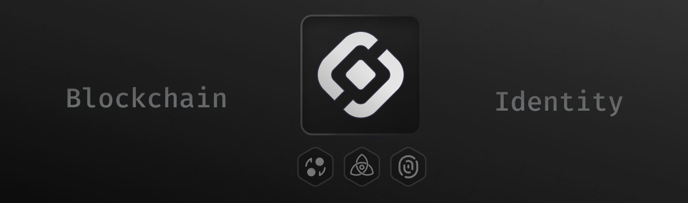

[](https://pkg.go.dev/github.com/sonr-io/sonr)

[](https://sonr.io)
[](https://goreportcard.com/report/github.com/sonr-io/sonr)

[](https://sonr.io)

> **Sonr is a blockchain ecosystem combining decentralized identity, secure data storage, and multi-chain interoperability. Built on Cosmos SDK v0.50.14, it provides users with self-sovereign identity through W3C DIDs, WebAuthn authentication, and personal data vaults—all without requiring cryptocurrency for onboarding.**

## 💡 Key Features

### 🔐 Gasless Onboarding

Create your first decentralized identity without owning cryptocurrency:

```bash
# Register with WebAuthn (no tokens required!)
snrd auth register --username alice

# Register with automatic vault creation
snrd auth register --username bob --auto-vault
```

### 🌐 Multi-Chain Support

- **Cosmos SDK**: Native integration with IBC ecosystem
- **EVM Compatibility**: Ethereum smart contract support
- **External Wallets**: MetaMask, Keplr, and more

### 🔑 Advanced Authentication

- **WebAuthn/Passkeys**: Biometric authentication
- **Hardware Security Keys**: YubiKey, Titan Key support
- **Multi-Signature**: Multiple verification methods per DID

### 📦 Decentralized Storage

- **IPFS Integration**: Distributed file storage
- **Encrypted Vaults**: Hardware-backed encryption
- **Protocol Schemas**: Structured data validation

## 📚 Technical Specifications

- **Cosmos SDK**: v0.50.14
- **CometBFT**: v0.38.17
- **IBC**: v8.7.0
- **Go**: 1.24.1 (toolchain 1.24.4)
- **WebAssembly**: CosmWasm v1.5.8
- **Task Queue**: Asynq (Redis-based)
- **Actor System**: Proto.Actor
- **Storage**: IPFS, LevelDB

## 🔒 Security

### Gasless Transaction Security

- Limited to WebAuthn registration only
- Full cryptographic validation required
- Credential uniqueness enforcement
- Anti-replay protection

### WebAuthn Security

- Origin validation
- Challenge-response authentication
- Device binding
- Attestation verification

### Multi-Algorithm Support

- Ed25519 (quantum-resistant)
- ECDSA (secp256k1, P-256)
- RSA (2048, 3072, 4096 bits)
- WebAuthn (ES256, RS256)

## 🚀 Quick Start

### Installation

```bash
# Clone the repository
git clone https://github.com/sonr-io/sonr
cd sonr

# Install the binary
make install

# Verify installation
snrd version
```

### Running a Local Node

```bash
# Start single-node testnet (quick iteration)
make localnet

# Start multi-node testnet with Starship
make testnet-start

# Stop testnet
make testnet-stop
```

### Building from Source

```bash
# Build all binaries
make build        # snrd blockchain node
make build-hway   # Highway service
make build-vault  # Vault WASM plugin

# Build Docker image
make docker

# Generate code from proto files
make proto-gen
```

### Local Development Network

```bash
# Standard localnet (auto-detects best method for your system)
make localnet     # Works on Arch Linux, Ubuntu, macOS, etc.

# Docker-based localnet (requires Docker)
make dockernet    # Runs in detached mode

# One-time setup for your system (optional)
./scripts/setup_localnet.sh  # Installs dependencies and configures environment
```

### Testing

```bash
# Run all tests
make test-all

# Module-specific tests
make test-did     # DID module tests
make test-dwn     # DWN module tests
make test-svc     # Service module tests

# E2E tests
make ictest-basic # Basic chain functionality
make ictest-ibc   # IBC transfers
make ictest-wasm  # CosmWasm integration

# Test with coverage
make test-cover
```

### Infrastructure

```bash
# IPFS for vault operations
make ipfs-up      # Start IPFS infrastructure
make ipfs-down    # Stop IPFS infrastructure
make ipfs-status  # Check IPFS connectivity
```

## 🏗️ Architecture

Sonr consists of three primary components and three custom modules:

### Service Architecture

```
┌─────────┐     ┌─────────┐     ┌─────────┐
│  Caddy  │────▶│  snrd   │     │  IPFS   │
└─────────┘     └─────────┘     └─────────┘
     │                │                │
     │                ▼                ▼
     │          ┌─────────┐     ┌─────────┐
     └─────────▶│ Highway │────▶│  Redis  │
                └─────────┘     └─────────┘
```

- **Caddy**: Reverse proxy with gRPC-Web support (port 80)
- **Redis**: Task queue backend for Highway (port 6379)
- **Highway**: UCAN-based task processor (port 8090)
- **IPFS**: Distributed storage (API: 5001, Gateway: 8080)
- **snrd**: Blockchain node (gRPC: 9090, REST: 1317)

### Cross-Platform Support

The `localnet` target now automatically detects and uses the best available method:
1. Checks for local binary (built with `make install`)
2. Falls back to Docker if available
3. Handles permission issues on systems like Arch Linux
4. Supports systemd service installation (see `etc/systemd/`)

### Core Components

#### 1. **Blockchain Node (`snrd`)**

The main blockchain daemon built with Cosmos SDK v0.50.14, providing:

- AutoCLI for command generation
- EVM compatibility via Evmos integration
- IBC for cross-chain communication
- CosmWasm smart contract support

#### 2. **Highway Service (`hway`)**

An Asynq-based task processing service for vault operations:

- Redis-backed job queue with priority levels
- Actor-based concurrency using Proto.Actor framework
- Processes cryptographic operations through WebAssembly enclaves

#### 3. **Motor Plugin (`motr`)**

WebAssembly-based vault system providing:

- Secure execution environment for sensitive operations
- Hardware-backed key management
- Multi-party computation capabilities

## 📖 Module Documentation

### DID Module

W3C DID specification implementation with:

- **Gasless WebAuthn Registration**: Create DIDs without cryptocurrency
- **Multi-Algorithm Signatures**: Ed25519, ECDSA, RSA, WebAuthn
- **External Wallet Linking**: MetaMask, Keplr integration
- **Verifiable Credentials**: W3C-compliant credential issuance

```bash
# Create a DID
snrd tx did create-did did:sonr:alice '{"id":"did:sonr:alice",...}' --from alice

# Link external wallet
snrd tx did link-external-wallet did:sonr:alice \
  --wallet-address 0x742d35Cc6635C0532925a3b8c17C6e583F4d6A42 \
  --wallet-type ethereum \
  --from alice

# Query DID
snrd query did resolve did:sonr:alice
```

[Full DID Module Documentation](x/did/README.md)

### DWN Module

Personal data stores with:

- **Structured Data Records**: Hierarchical data organization
- **Protocol-Based Interactions**: Enforceable data schemas
- **Secure Vaults**: Enclave-based key management
- **Multi-Chain Support**: Cosmos SDK and EVM transaction building

```bash
# Create a vault
snrd tx dwn create-vault --from alice

# Store a record
snrd tx dwn write-record '{"data":"...", "protocol":"example.com"}' --from alice

# Query records
snrd query dwn records --owner alice
```

[Full DWN Module Documentation](x/dwn/README.md)

### Service Module

Decentralized service registry featuring:

- **Domain Verification**: DNS-based ownership proof
- **Service Registration**: Verified service endpoints
- **Permission Management**: UCAN capability integration

```bash
# Verify domain ownership
snrd tx svc initiate-domain-verification example.com --from alice
snrd tx svc verify-domain example.com --from alice

# Register service
snrd tx svc register-service my-service example.com \
  --permissions "read,write" --from alice
```

[Full Service Module Documentation](x/svc/README.md)

## 🔧 Configuration

### Environment Variables

Environment variables can be configured via Docker Compose:

```bash
# Chain configuration
export CHAIN_ID="localchain_9000-1"
export BLOCK_TIME="1000ms"

# Network selection for Starship
export NETWORK="devnet"  # or "testnet"

# Redis configuration
REDIS_URL=redis://redis:6379
REDIS_DB=0

# Highway service
HIGHWAY_PORT=8090
LOG_LEVEL=debug

# IPFS configuration
IPFS_API_URL=http://ipfs:5001

# Caddy configuration
CADDY_DOMAIN=localhost
```

Environment variables can be set directly or via a `.env` file in the project root.

### Docker Compose Services

The project includes a comprehensive Docker Compose setup for running all backend services:

```bash
# Start all services (Redis, Highway, Caddy, IPFS)
make docker-up

# Stop all services
make docker-down

# View service logs
make docker-logs           # All services
make docker-logs-redis     # Specific service

# Check service health
make docker-status

# Clean up Docker resources
make docker-clean
```

### Starship Configuration

Edit `starship.yml` to configure multi-node testnets:

```yaml
chains:
  - id: sonrtest_1-1
    name: custom
    numValidators: 3
    image: onsonr/snrd:latest
    # ... additional configuration
```

#### Troubleshooting

**Services not starting:**
```bash
# Check service status
make docker-status

# View detailed logs
make docker-logs

# Ensure Docker network exists
docker network ls | grep sonr-network
```

**Redis connection issues:**
```bash
# Test Redis connectivity
docker exec redis redis-cli ping

# Check Redis logs
make docker-logs-redis
```

**IPFS not accessible:**
```bash
# Verify IPFS is running
curl http://127.0.0.1:5001/api/v0/version

# Check IPFS logs
docker compose -f etc/stack/compose.yml logs ipfs
```

**Port conflicts:**
- Caddy: 80 (HTTP)
- Redis: 6379
- Highway: 8090
- IPFS API: 5001
- IPFS Gateway: 8080

Stop conflicting services or modify ports in `etc/stack/compose.yml`.

## 🏗️ Project Structure

Sonr uses a modern monorepo architecture with pnpm workspaces for JavaScript/TypeScript packages alongside the Go blockchain implementation:

### Workspace Organization

```
sonr/
├── app/              # Application setup and module wiring
├── cmd/              # Binary entry points
│   ├── snrd/        # Blockchain node
│   ├── hway/        # Highway service
│   └── motr/        # Motor WASM plugin
├── x/               # Custom chain modules
│   ├── did/         # W3C DID implementation
│   ├── dwn/         # Decentralized Web Nodes
│   └── svc/         # Service management
├── types/           # Internal packages
│   ├── coins/       # Task processing
│   └── ipfs/        # Authorization networks
├── proto/           # Protobuf definitions
├── scripts/         # Utility scripts
├── test/            # Integration tests
├── docs/            # Documentation site
│
# Monorepo Packages (pnpm workspaces)
├── packages/         # Core JavaScript/TypeScript packages
│   ├── es/          # @sonr.io/es - ES client library
│   ├── sdk/         # @sonr.io/sdk - SDK package
│   └── ui/          # @sonr.io/ui - Shared UI components
├── cli/             # CLI tools
│   ├── install/     # @sonr.io/install - Installation CLI
│   └── join-testnet/# @sonr.io/join-testnet - Testnet CLI
└── web/             # Web applications
    ├── auth/        # Authentication app (Next.js)
    └── dash/        # Dashboard app (Next.js)
```

### Working with the Monorepo

#### Installation

```bash
# Install all dependencies for the monorepo
pnpm install

# Build all packages
pnpm build

# Run development mode for all packages
pnpm dev
```

#### Package Management

```bash
# Run commands in specific packages
pnpm --filter @sonr.io/es build
pnpm --filter @sonr.io/sdk test

# Add dependencies to specific packages
pnpm --filter @sonr.io/ui add react

# Run commands in all packages
pnpm -r build  # Build all packages
pnpm -r test   # Test all packages
```

#### Versioning & Publishing

The monorepo uses [Changesets](https://github.com/changesets/changesets) for package versioning:

```bash
# Add a changeset for your changes
pnpm changeset

# Version packages based on changesets
pnpm changeset version

# Publish packages to npm
pnpm changeset publish
```

### Key Technologies

- **pnpm workspaces**: Efficient dependency management with single lockfile
- **TypeScript project references**: Incremental builds and better IDE performance
- **Turbo**: Build orchestration and caching for faster builds
- **Changesets**: Automated versioning and changelog generation
- **Biome**: Fast, unified linting and formatting (replaces ESLint/Prettier)

### Package Dependencies

- `@sonr.io/es`: Core ES client library with protobuf types
- `@sonr.io/sdk`: High-level SDK (depends on @sonr.io/es)
- `@sonr.io/ui`: Shared UI components for web applications
- `@sonr.io/install`: CLI tool for installing Sonr
- `@sonr.io/join-testnet`: CLI tool for joining testnet
- Web apps use all three core packages (@sonr.io/es, @sonr.io/sdk, @sonr.io/ui)

## 🤝 Community & Support

- [GitHub Discussions](https://github.com/sonr-io/sonr/discussions) - Community forum
- [GitHub Issues](https://github.com/sonr-io/sonr/issues) - Bug reports and feature requests
- [Twitter](https://sonr.io/twitter) - Latest updates
- [Documentation Wiki](https://github.com/sonr-io/sonr/wiki) - Detailed guides


## 📄 License

Copyright © 2024 Sonr, Inc.

Licensed under the Apache License, Version 2.0. See [LICENSE](LICENSE) for details.

---

<p align="center">
  Built with ❤️ by the Sonr team
</p>
