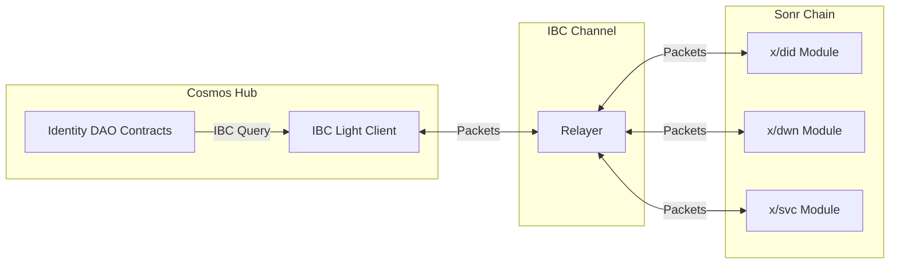

# IBC Integration for Identity DAO

## Overview

The Identity DAO will be deployed on Cosmos Hub and communicate with Sonr chain modules via IBC (Inter-Blockchain Communication). This document outlines the IBC integration architecture and implementation details.

## Architecture



## IBC Channel Configuration

### Channel Setup

```bash
# Create IBC channel between Cosmos Hub and Sonr
hermes create channel \
  --a-chain cosmoshub-4 \
  --b-chain sonr-1 \
  --a-port wasm.cosmos1... \
  --b-port did \
  --order unordered \
  --version ics20-1
```

### Connection Parameters

```json
{
  "channel_id": "channel-xxx",
  "port_id": "wasm.cosmos1abc...",
  "counterparty_channel_id": "channel-yyy",
  "counterparty_port_id": "did",
  "connection_id": "connection-xxx",
  "version": "ics20-1"
}
```

## Contract Modifications for IBC

### 1. IBC Entry Points

Add IBC entry points to each contract:

```rust
// contracts/core/src/ibc.rs
use cosmwasm_std::{
    entry_point, IbcBasicResponse, IbcChannelCloseMsg, IbcChannelConnectMsg,
    IbcChannelOpenMsg, IbcChannelOpenResponse, IbcPacketAckMsg, IbcPacketReceiveMsg,
    IbcPacketTimeoutMsg, IbcReceiveResponse, Never,
};

#[entry_point]
pub fn ibc_channel_open(
    _deps: DepsMut,
    _env: Env,
    msg: IbcChannelOpenMsg,
) -> Result<IbcChannelOpenResponse, ContractError> {
    // Validate channel parameters
    validate_channel(&msg.channel)?;
    Ok(None)
}

#[entry_point]
pub fn ibc_channel_connect(
    deps: DepsMut,
    _env: Env,
    msg: IbcChannelConnectMsg,
) -> Result<IbcBasicResponse, ContractError> {
    // Store channel info
    let channel = msg.channel();
    CHANNEL_INFO.save(deps.storage, &channel.endpoint, &channel)?;
    
    Ok(IbcBasicResponse::new()
        .add_attribute("method", "ibc_channel_connect")
        .add_attribute("channel_id", channel.endpoint.channel_id))
}

#[entry_point]
pub fn ibc_packet_receive(
    deps: DepsMut,
    env: Env,
    msg: IbcPacketReceiveMsg,
) -> Result<IbcReceiveResponse, Never> {
    // Handle incoming IBC packets
    let packet = msg.packet;
    let res = handle_packet(deps, env, packet)?;
    
    Ok(IbcReceiveResponse::new()
        .set_ack(res.acknowledgement)
        .add_attributes(res.attributes))
}
```

### 2. Cross-Chain DID Queries

Replace Stargate queries with IBC queries:

```rust
// contracts/voting/src/ibc_query.rs
use cosmwasm_std::{to_binary, Binary, Deps, Env, IbcMsg, IbcTimeout};

pub fn query_did_via_ibc(
    deps: Deps,
    env: Env,
    did: String,
) -> Result<IbcMsg, ContractError> {
    let channel = CHANNEL_INFO.load(deps.storage)?;
    
    let query_msg = DIDQuery {
        query_type: "get_did_document",
        did,
    };
    
    let packet = IbcMsg::SendPacket {
        channel_id: channel.endpoint.channel_id,
        data: to_binary(&query_msg)?,
        timeout: IbcTimeout::with_timestamp(env.block.time.plus_seconds(60)),
    };
    
    Ok(packet)
}

pub fn handle_did_response(
    deps: DepsMut,
    response: Binary,
) -> Result<(), ContractError> {
    let did_doc: DIDDocumentResponse = from_binary(&response)?;
    
    // Cache DID document for voting power calculation
    DID_CACHE.save(
        deps.storage,
        &did_doc.document.id,
        &did_doc,
    )?;
    
    Ok(())
}
```

### 3. Asynchronous Voting Power

Since IBC queries are asynchronous, modify voting to handle this:

```rust
// contracts/voting/src/state.rs
pub struct PendingVote {
    pub voter: Addr,
    pub proposal_id: u64,
    pub vote: Vote,
    pub did_query_id: String,
}

pub const PENDING_VOTES: Map<String, PendingVote> = Map::new("pending_votes");

// contracts/voting/src/contract.rs
pub fn execute_vote(
    deps: DepsMut,
    env: Env,
    info: MessageInfo,
    proposal_id: u64,
    vote: Vote,
) -> Result<Response, ContractError> {
    // Check if we have cached DID info
    let did = format!("did:sonr:{}", info.sender);
    
    if let Some(did_doc) = DID_CACHE.may_load(deps.storage, &did)? {
        // Process vote immediately
        process_vote(deps, env, info.sender, proposal_id, vote, did_doc)
    } else {
        // Queue vote and query DID via IBC
        let query_id = generate_query_id(&env, &info.sender);
        
        PENDING_VOTES.save(
            deps.storage,
            &query_id,
            &PendingVote {
                voter: info.sender,
                proposal_id,
                vote,
                did_query_id: query_id.clone(),
            },
        )?;
        
        let ibc_msg = query_did_via_ibc(deps.as_ref(), env, did)?;
        
        Ok(Response::new()
            .add_message(ibc_msg)
            .add_attribute("action", "vote_pending")
            .add_attribute("query_id", query_id))
    }
}
```

## IBC Packet Types

### DID Query Packet

```rust
#[derive(Serialize, Deserialize, Clone, Debug, PartialEq)]
pub struct DIDQueryPacket {
    pub query_type: String,
    pub did: String,
    pub requester: String,
    pub callback_id: String,
}

#[derive(Serialize, Deserialize, Clone, Debug, PartialEq)]
pub struct DIDResponsePacket {
    pub callback_id: String,
    pub did_document: Option<DIDDocument>,
    pub verification_status: VerificationStatus,
    pub error: Option<String>,
}
```

### Cross-Chain Proposal Packet

```rust
#[derive(Serialize, Deserialize, Clone, Debug, PartialEq)]
pub struct CrossChainProposalPacket {
    pub proposal_type: String,
    pub target_module: String, // "did", "dwn", or "svc"
    pub action: String,
    pub params: Binary,
    pub proposer_did: String,
}
```

## Deployment Scripts Update

### Cosmos Hub Deployment

```bash
#!/bin/bash
# deploy_cosmoshub.sh

# Cosmos Hub configuration
CHAIN_ID="cosmoshub-4"
NODE="https://rpc.cosmos.network:443"
DEPLOYER="cosmos1..."
GAS_PRICES="0.025uatom"

# Deploy contracts
gaiad tx wasm store artifacts/identity_dao_core.wasm \
  --from $DEPLOYER \
  --chain-id $CHAIN_ID \
  --node $NODE \
  --gas-prices $GAS_PRICES \
  --broadcast-mode block

# Instantiate with IBC configuration
INIT_MSG=$(cat <<EOF
{
  "admin": "$DEPLOYER",
  "dao_name": "Sonr Identity DAO",
  "dao_uri": "https://sonr.io/dao",
  "ibc_config": {
    "sonr_channel": "channel-xxx",
    "sonr_port": "did",
    "timeout_seconds": 60
  }
}
EOF
)

gaiad tx wasm instantiate $CODE_ID "$INIT_MSG" \
  --from $DEPLOYER \
  --label "identity-dao-core" \
  --admin $DEPLOYER
```

### IBC Channel Setup

```bash
#!/bin/bash
# setup_ibc.sh

# Install Hermes relayer
cargo install ibc-relayer-cli --version 1.0.0

# Configure relayer
hermes config init

# Add chains
hermes chains add cosmoshub-4
hermes chains add sonr-1

# Create client, connection, and channel
hermes create channel \
  --a-chain cosmoshub-4 \
  --b-chain sonr-1 \
  --a-port "wasm.$DAO_CONTRACT" \
  --b-port "did" \
  --order unordered

# Start relayer
hermes start
```

## Testing IBC Integration

### Local Testing with IBC

```go
// tests/e2e/ibc_test.go
func TestIBCDIDQuery(t *testing.T) {
    // Setup two chains
    cosmosHub := setupCosmosHub()
    sonrChain := setupSonrChain()
    
    // Create IBC channel
    channel := createIBCChannel(cosmosHub, sonrChain)
    
    // Deploy DAO on Cosmos Hub
    daoAddr := deployDAO(cosmosHub)
    
    // Create DID on Sonr
    did := createDID(sonrChain, "test-user")
    
    // Query DID via IBC from DAO
    response := queryDIDViaIBC(daoAddr, did, channel)
    
    assert.NotNil(t, response)
    assert.Equal(t, did, response.Document.ID)
}
```

### Integration Test Script

```bash
#!/bin/bash
# test_ibc_integration.sh

# Start local chains
ignite chain serve -c cosmoshub &
COSMOS_PID=$!

ignite chain serve -c sonr &
SONR_PID=$!

# Wait for chains
sleep 10

# Setup IBC
bash setup_ibc.sh

# Deploy contracts
bash deploy_cosmoshub.sh

# Run test transactions
echo "Testing IBC DID query..."
gaiad tx wasm execute $DAO_ADDR \
  '{"query_did_ibc":{"did":"did:sonr:test123"}}' \
  --from tester

# Check results
gaiad query wasm contract-state smart $DAO_ADDR \
  '{"get_cached_did":{"did":"did:sonr:test123"}}'

# Cleanup
kill $COSMOS_PID $SONR_PID
```

## Security Considerations

### IBC-Specific Security

1. **Channel Authentication**: Verify channel is connected to correct Sonr chain
2. **Packet Validation**: Validate all incoming IBC packets
3. **Timeout Handling**: Handle packet timeouts gracefully
4. **Replay Protection**: Ensure packets cannot be replayed

### Trust Assumptions

1. **Relayer Trust**: Relayers cannot forge packets but can censor
2. **Light Client Security**: Depends on IBC light client security
3. **Cross-Chain Atomicity**: No atomicity guarantees across chains

## Gas Costs

### IBC Operations Gas Estimates

| Operation | Gas Cost |
|-----------|----------|
| IBC Channel Open | 150,000 |
| IBC Packet Send | 80,000 |
| IBC Packet Receive | 100,000 |
| IBC Acknowledgement | 60,000 |
| DID Query via IBC | 180,000 |

## Migration from Stargate to IBC

### Before (Stargate)
```rust
let query = QueryRequest::Stargate {
    path: "/sonr.did.Query/GetDIDDocument".to_string(),
    data: Binary::from(query_data),
};
let response: DIDDocumentResponse = deps.querier.query(&query)?;
```

### After (IBC)
```rust
let ibc_msg = IbcMsg::SendPacket {
    channel_id: channel.id,
    data: to_binary(&DIDQueryPacket {
        query_type: "get_did_document".to_string(),
        did: did.clone(),
        requester: info.sender.to_string(),
        callback_id: generate_callback_id(),
    })?,
    timeout: IbcTimeout::with_timestamp(env.block.time.plus_seconds(60)),
};
// Response handled asynchronously in ibc_packet_receive
```

## Monitoring and Maintenance

### Metrics to Track

1. IBC packet success rate
2. Average query latency
3. Channel uptime
4. Relayer performance

### Maintenance Tasks

1. Update relayer configuration
2. Monitor channel health
3. Handle stuck packets
4. Upgrade IBC client

## Conclusion

IBC integration enables the Identity DAO on Cosmos Hub to securely interact with Sonr chain modules. The asynchronous nature of IBC requires architectural changes but provides better security and decentralization compared to direct module access.