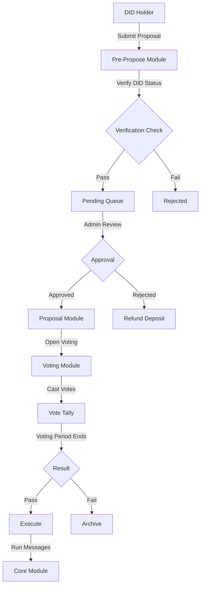

# Identity DAO - Decentralized Identity Governance

A modular Decentralized Identity DAO implementation for the Sonr blockchain, integrating with the x/did module to provide identity-based governance capabilities.

## Overview

The Identity DAO enables decentralized governance where voting power and proposal submission rights are determined by verified identity status rather than token holdings. This creates a more equitable governance system based on identity verification levels.

## Architecture

The DAO follows [DAO DAO's modular architecture](https://github.com/DA0-DA0/dao-contracts) with four core components:

### 1. Identity DAO Core Module
- **Location**: `/contracts/core/`
- **Purpose**: Central coordination and treasury management
- **Key Features**:
  - Treasury management for DAO funds
  - Proposal execution orchestration
  - Module registry and configuration
  - Wyoming DAO compliance features

### 2. DID-Based Voting Module  
- **Location**: `/contracts/voting/`
- **Purpose**: Identity-based voting power calculation
- **Key Features**:
  - Voting power based on DID verification level
  - Reputation-weighted voting
  - Quorum and threshold management
  - Vote tallying and results

### 3. Identity Proposal Module
- **Location**: `/contracts/proposals/`
- **Purpose**: Proposal lifecycle management
- **Key Features**:
  - Proposal creation and state management
  - Identity-gated proposal types
  - Execution scheduling
  - Multi-signature support

### 4. Pre-Propose Identity Module
- **Location**: `/contracts/pre-propose/`  
- **Purpose**: DID-gated proposal submission
- **Key Features**:
  - Verification requirements for proposers
  - Deposit management
  - Anti-spam mechanisms
  - Proposal review workflow

## Installation

### Prerequisites

- Rust 1.70+
- Docker (for contract optimization)
- `snrd` binary (Sonr blockchain node)
- `jq` for JSON processing

### Building Contracts

```bash
# Build all contracts with optimizer
cd contracts/DAO
docker run --rm -v "$(pwd)":/code \
  --mount type=volume,source="$(basename "$(pwd)")_cache",target=/target \
  --mount type=volume,source=registry_cache,target=/usr/local/cargo/registry \
  cosmwasm/workspace-optimizer:0.13.0

# Artifacts will be in ./artifacts/
```

## Deployment

### Quick Deploy

```bash
# Set environment variables
export CHAIN_ID="sonrtest_1-1"
export NODE="http://localhost:26657"
export DEPLOYER="your-key-name"

# Run deployment script
./scripts/deploy.sh
```

### Manual Deployment

1. **Store Contract Codes**:
```bash
# Store each contract
snrd tx wasm store artifacts/identity_dao_core.wasm \
  --from $DEPLOYER --chain-id $CHAIN_ID --gas-prices 0.025usnr

# Repeat for voting, proposals, and pre-propose modules
```

2. **Instantiate Core Module**:
```bash
snrd tx wasm instantiate $CORE_CODE_ID \
  '{"admin":"'$DEPLOYER'","dao_name":"Sonr Identity DAO","dao_uri":"https://sonr.io/dao","voting_module":null,"proposal_modules":[]}' \
  --from $DEPLOYER --label "identity-dao-core" --admin $DEPLOYER
```

3. **Deploy Other Modules** (see deployment script for details)

4. **Link Modules**:
```bash
# Update core with voting and proposal modules
snrd tx wasm execute $CORE_ADDR \
  '{"update_config":{"voting_module":"'$VOTING_ADDR'","proposal_modules":["'$PROPOSALS_ADDR'"]}}' \
  --from $DEPLOYER
```

## Contract Interactions

### Creating a Proposal

1. **Submit to Pre-Propose Module**:
```bash
snrd tx wasm execute $PRE_PROPOSE_ADDR \
  '{"submit_proposal":{"title":"Upgrade Protocol","description":"Upgrade to v2.0","msgs":[...]}}' \
  --from $PROPOSER --amount 1000000usnr
```

2. **Admin Approval** (if required):
```bash
snrd tx wasm execute $PRE_PROPOSE_ADDR \
  '{"approve_proposal":{"proposal_id":1}}' \
  --from $ADMIN
```

### Voting

```bash
# Cast a vote
snrd tx wasm execute $VOTING_ADDR \
  '{"vote":{"proposal_id":1,"vote":"yes"}}' \
  --from $VOTER

# Vote options: "yes", "no", "abstain", "no_with_veto"
```

### Executing Proposals

```bash
# After voting period ends and proposal passes
snrd tx wasm execute $PROPOSALS_ADDR \
  '{"execute":{"proposal_id":1}}' \
  --from $EXECUTOR
```

## Query Commands

### Query Proposal Status
```bash
snrd query wasm contract-state smart $PROPOSALS_ADDR \
  '{"proposal":{"proposal_id":1}}'
```

### Query Voting Power
```bash
snrd query wasm contract-state smart $VOTING_ADDR \
  '{"voting_power":{"address":"sonr1..."}}'
```

### Query DAO Configuration
```bash
snrd query wasm contract-state smart $CORE_ADDR \
  '{"config":{}}'
```

### List Pending Proposals
```bash
snrd query wasm contract-state smart $PRE_PROPOSE_ADDR \
  '{"pending_proposals":{}}'
```

## Governance Flow



## Verification Levels

The DAO recognizes four verification levels:

| Level | Name | Voting Power Multiplier | Proposal Rights |
|-------|------|------------------------|-----------------|
| 0 | Unverified | 0x | None |
| 1 | Basic | 1x | Standard proposals |
| 2 | Advanced | 2x | Policy changes |
| 3 | Full | 3x | All proposals |

## Wyoming DAO Compliance

The Identity DAO includes features for Wyoming DAO legal compliance:

- **Named Entity**: DAO name and URI stored on-chain
- **Member Registry**: DID-based membership tracking
- **Voting Records**: All votes recorded on-chain
- **Treasury Management**: Transparent fund management
- **Governance Rules**: Codified in smart contracts

## Security Considerations

### Access Control
- Admin functions restricted to DAO governance
- Module interactions validated
- DID verification required for participation

### Economic Security
- Deposit requirements for proposals
- Refund mechanisms for failed proposals
- Anti-spam through verification requirements

### Upgrade Security
- Migration support with admin approval
- Code ID tracking for audit trail
- Gradual rollout capabilities

## Testing

### Unit Tests
```bash
cd contracts/DAO
cargo test
```

### Integration Tests
```bash
# Run e2e tests (requires running testnet)
cd tests/e2e
go test -v ./...
```

### Local Testnet
```bash
# Start local testnet
make localnet

# Deploy contracts
./scripts/deploy.sh

# Run test transactions
./scripts/test_governance.sh
```

## Migration

To migrate contracts to new versions:

```bash
# Migrate single module
./scripts/migrate.sh core

# Migrate all modules
./scripts/migrate.sh all
```

## Gas Optimization

### Recommended Gas Settings
- **Store Code**: 5,000,000 gas
- **Instantiate**: 500,000 gas
- **Execute (simple)**: 200,000 gas
- **Execute (complex)**: 1,000,000 gas
- **Query**: No gas required

### Optimization Tips
1. Batch operations when possible
2. Use efficient data structures
3. Minimize storage writes
4. Cache frequently accessed data

## Troubleshooting

### Common Issues

**Issue**: "Insufficient verification level"
- **Solution**: Ensure your DID has the required verification level

**Issue**: "Insufficient deposit"  
- **Solution**: Include the minimum deposit amount with proposal submission

**Issue**: "Unauthorized"
- **Solution**: Check that you have the correct role/permissions

**Issue**: "Proposal already executed"
- **Solution**: Proposals can only be executed once

## API Reference

### Core Module

#### Execute Messages
- `UpdateConfig`: Update DAO configuration
- `ExecuteProposal`: Execute approved proposal
- `UpdateAdmin`: Transfer admin rights

#### Query Messages
- `Config`: Get DAO configuration
- `Admin`: Get current admin
- `ProposalModules`: List proposal modules

### Voting Module

#### Execute Messages
- `Vote`: Cast a vote on a proposal
- `UpdateConfig`: Update voting parameters

#### Query Messages
- `VotingPower`: Get address voting power
- `ProposalVotes`: Get votes for a proposal
- `Config`: Get voting configuration

### Proposals Module

#### Execute Messages
- `Propose`: Create a new proposal
- `Execute`: Execute passed proposal
- `Close`: Close expired proposal

#### Query Messages
- `Proposal`: Get proposal details
- `ListProposals`: List all proposals
- `ProposalResult`: Get proposal outcome

### Pre-Propose Module

#### Execute Messages
- `SubmitProposal`: Submit proposal for review
- `ApproveProposal`: Approve pending proposal
- `RejectProposal`: Reject pending proposal
- `WithdrawProposal`: Withdraw pending proposal

#### Query Messages
- `PendingProposals`: List pending proposals
- `DepositInfo`: Get deposit information
- `Config`: Get module configuration

## Contributing

Please see the main [Sonr contribution guidelines](https://sonr.dev/contributing).

## License

This project is licensed under the Apache 2.0 License - see the [LICENSE](../../LICENSE) file for details.

## Support

- GitHub Issues: [sonr-io/sonr](https://github.com/sonr-io/sonr/issues)
- Discord: [Sonr Community](https://discord.gg/sonr)
- Documentation: [docs.sonr.io](https://sonr.dev)
