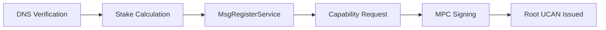
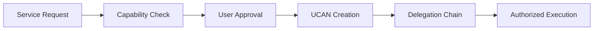

## Overview

SNR token transactions power the revolutionary Sonr ecosystem, enabling gasless onboarding, stake-based service registration, and UCAN-authorized operations. The unique architecture allows for both traditional fee-based transactions and innovative gasless user experiences.

<Note>
  Sonr features both traditional fee-based transactions and revolutionary
  gasless operations like vault claiming, enabling zero-barrier user onboarding
  while maintaining network security through economic incentives.
</Note>

## Transaction Types

### Basic Transfers

The foundation of the SNR economy consists of peer-to-peer token transfers:

<CardGroup>
  <Card title="Simple Transfers">
    Direct SNR transfers between addresses with minimal gas fees
  </Card>
  <Card title="Multi-send">
    Batch transfers to multiple recipients in a single transaction
  </Card>
  <Card title="Scheduled Transfers">
    Time-locked transfers with vesting or release conditions
  </Card>
</CardGroup>

### Module-Specific Transactions

Each Sonr core module enables specialized transaction types with specific SNR token requirements:

#### Service Module (x/svc) Transactions

- **MsgRegisterService**: Register a new service with TLD domain verification and capability requests
- **MsgUpdateService**: Update service metadata or request additional permissions
- **DNS Verification**: Simple DNS TXT record verification for domain ownership
- **Stake Requirements**: Services must stake SNR tokens based on requested capabilities

#### DWN Module (x/dwn) Transactions

- **MsgClaimVault**: **Gasless** transaction for claiming user vaults during onboarding
- **Vault Configuration Updates**: Paid transactions for advanced vault settings and WASM runtime upgrades
- **Cross-Chain Operations**: SNR fees for multi-chain vault management and bridging
- **MPC Operations**: Transaction fees for multi-party computation within secure enclaves

#### UCAN Module (x/ucan) Transactions

- **MsgIssueRootCapability**: Request MPC threshold signing for root capability tokens
- **MsgSubmitThresholdShare**: Validators submit MPC shares for capability creation
- **MsgRevokeCapability**: Revoke previously issued capability tokens on-chain
- **Delegation Chain Processing**: Computational fees for validating complex authorization chains

#### DID Module (x/did) Transactions

- **DID Registration**: Fees for creating new decentralized identifiers
- **MsgLinkAuthentication**: Add WebAuthn credentials or other authentication methods
- **MsgLinkAssertion**: Link identity claims and verifications to DIDs
- **MsgExecuteTx**: Execute UCAN-authorized transactions on behalf of DIDs

## Fee Structure

### Dual Fee Model

Sonr implements a revolutionary dual fee model supporting both traditional gas fees and gasless operations:

```math
\text{Fee} = \begin{cases}
0 & \text{for gasless operations (vault claiming)} \\
\text{Base Cost} + (\text{Gas Used} \times \text{Gas Price}) & \text{for standard transactions}
\end{cases}
```

<Warning>
  While basic vault claiming is gasless, advanced operations like service
  registration, MPC signing, and cross-chain transactions require SNR tokens for
  network security and spam prevention.
</Warning>

### Fee Components

<CardGroup>
  <Card title="MPC Computation">
    Multi-party computation costs for threshold signing and capability issuance
  </Card>
  <Card title="Stake-Based Security">
    Service registration fees that are burned or sent to community pool
  </Card>
  <Card title="Cross-Chain Operations">
    IBC and InterchainAccount transaction costs for bridgeless operations
  </Card>
  <Card title="Identity Operations">
    DID registration, authentication linking, and credential management
  </Card>
</CardGroup>

### Economic Mechanisms

The network implements sophisticated economic mechanisms:

1. **Gasless Subsidies**: Network subsidizes vault claiming for zero-barrier onboarding
2. **Stake-Based Pricing**: Service registration costs scale with capability requests
3. **MPC Rewards**: Validators earn additional fees for threshold signing participation
4. **Deflationary Pressure**: Service registration fees are burned, reducing total supply

## Transaction Lifecycle

### Gasless Vault Claiming Flow


### Service Registration Flow



### UCAN Authorization Flow



### Standard Transaction Processing

1. **UCAN Validation**: Check authorization tokens and delegation chains
2. **Module Routing**: Route to appropriate module (svc, dwn, ucan, did)
3. **MPC Coordination**: Multi-party computation for sensitive operations
4. **State Updates**: Update module-specific state and emit events
5. **Fee Distribution**: Distribute fees to validators, burn pool, and treasury

## Advanced Features

### UCAN-Powered Automation

Enable sophisticated authorization patterns:

<CardGroup>
  <Card title="Capability Delegation">
    Services receive granular, time-limited permissions from users
  </Card>
  <Card title="Agent Execution">
    Motr Vaults execute pre-authorized actions without user intervention
  </Card>
  <Card title="Subscription Automation">
    Recurring payments and service interactions through UCAN tokens
  </Card>
</CardGroup>

### Multi-Party Computation Integration

Leverage MPC for secure operations:

- **Threshold Signing**: Validators collaborate to issue root capabilities
- **Key Sharding**: No single point of failure for vault key management
- **Secure Enclaves**: WASM-based computation with hardware security
- **Privacy Preservation**: Zero-knowledge proofs for sensitive operations

### Cross-Module Interactions

Transactions can interact with multiple Sonr modules in powerful combinations:

```typescript
// Example: Complete user onboarding with service registration
const tx = {
  messages: [
    // DID Module: Create decentralized identity
    {
      type: "did/MsgCreateDID",
      creator: "sonr1abc...",
      document: didDocument,
      webauthnCredential: credential,
    },
    // DWN Module: Claim gasless vault
    {
      type: "dwn/MsgClaimVault",
      creator: "did:sonr:alice123",
      vaultConfig: vaultCID,
      mpcThreshold: 3,
    },
    // Service Module: Register domain service
    {
      type: "svc/MsgRegisterService",
      creator: "did:sonr:alice123",
      domain: "alice-app.com",
      capabilities: ["dwn:read", "dwn:write"],
      stakeAmount: "5000usnr",
    },
    // UCAN Module: Request root capability
    {
      type: "ucan/MsgIssueRootCapability",
      issuer: "did:sonr:alice123",
      audience: "alice-app.com",
      capabilities: ["service:register"],
    },
  ],
  fee: {
    amount: [{ denom: "usnr", amount: "5000" }], // Only service registration fee
    gasLimit: "500000",
  },
  memo: "Complete onboarding: Identity + Vault + Service + Capabilities",
};

// Example: Cross-chain payment automation
const paymentTx = {
  messages: [
    // UCAN: Validate payment authority
    {
      type: "ucan/MsgValidateCapability",
      token: ucanPaymentToken,
      requestedAction: "payment:send",
    },
    // DID: Execute authorized transaction
    {
      type: "did/MsgExecuteTx",
      signer: "did:sonr:alice123",
      targetChain: "osmosis-1",
      transaction: swapTransaction,
      authorization: ucanToken,
    },
  ],
};
```

## Performance Optimization

### Module-Specific Batching

Optimize transactions by batching within module boundaries:

1. **DWN Operations**: Batch vault updates and data operations
2. **Service Operations**: Group domain verifications and capability requests
3. **UCAN Processing**: Batch capability validations and delegation chains
4. **Cross-Chain Coordination**: Bundle InterchainAccount operations

### Gasless Operation Prioritization

Sonr prioritizes gasless operations to enhance user experience:

<Check>
  Gasless vault claiming is prioritized by validators to enable zero-friction
  onboarding. Service registration and MPC operations use dynamic pricing based
  on network demand and stake requirements.
</Check>

### MPC Coordination Efficiency

Multi-party computation operations are optimized for performance:

```typescript
// MPC threshold signing optimization
interface MPCOptimization {
  parallelShares: boolean; // Generate shares in parallel
  precomputedCommitments: boolean; // Cache commitments
  batchSigning: boolean; // Sign multiple capabilities together
  networkSharding: boolean; // Distribute computation load
}
```

## Security Considerations

### Module-Specific Security

- **DID Security**: WebAuthn hardware-backed authentication prevents identity theft
- **UCAN Validation**: Cryptographic proof chains ensure capability authenticity
- **Vault Isolation**: MPC key sharding prevents single points of failure
- **Service Reputation**: Stake-based trust system deters malicious actors

### Zero-Knowledge Privacy

Sonr implements privacy-preserving transaction patterns:

```typescript
// Privacy-preserving operations
interface PrivacyFeatures {
  zkProofs: {
    ageVerification: boolean; // Prove age without revealing birthdate
    balanceProofs: boolean; // Prove sufficient funds without amounts
    reputationProofs: boolean; // Prove service quality without data
  };
  selectiveDisclosure: {
    didDocuments: boolean; // Share only necessary identity claims
    vaultData: boolean; // Controlled data access permissions
    paymentHistory: boolean; // Private transaction records
  };
}
```

### Best Practices for Sonr Transactions

1. **UCAN Validation**: Always verify capability tokens before execution
2. **MPC Coordination**: Ensure threshold requirements are met
3. **Gasless Limits**: Monitor gasless operation quotas and fallbacks
4. **Cross-Chain Safety**: Validate IBC channel security and timeouts

## Fee Distribution

SNR transaction fees are distributed to align network incentives:

<CardGroup>
  <Card title="Validators (35%)">
    Block proposers and MPC threshold signers receive primary rewards
  </Card>
  <Card title="Burn Pool (25%)">
    Service registration fees burned for deflationary pressure
  </Card>
  <Card title="Community Treasury (25%)">
    Development and ecosystem growth funds
  </Card>
  <Card title="Gasless Subsidy (10%)">
    Funds vault claiming and onboarding operations
  </Card>
  <Card title="IBC Relayers (5%)">
    Cross-chain message delivery and InterchainAccount operations
  </Card>
</CardGroup>

### Module-Specific Fee Sources

```typescript
// Fee sources by module
interface ModuleFees {
  svc: {
    domainRegistration: "25% to burn, 75% to validators";
    capabilityRequests: "Deposit-based, refundable on completion";
    stakeSlashing: "100% to community treasury";
  };

  dwn: {
    vaultClaiming: "Gasless (subsidized by treasury)";
    storageOperations: "Standard gas fees";
    mpcOperations: "Premium fees for computation";
  };

  ucan: {
    rootCapabilityIssuance: "MPC coordination fees";
    delegationValidation: "Minimal computational costs";
    revocations: "Standard gas fees";
  };

  did: {
    didRegistration: "One-time identity creation fee";
    credentialLinking: "WebAuthn integration costs";
    crossChainExecution: "IBC and InterchainAccount fees";
  };
}
```

## Future Enhancements

### Revolutionary Capabilities in Development

- **AI-Powered Automation**: Natural language transaction commands through Motr Vault agents
- **Predictive Authorization**: Pre-approve expected transactions based on user patterns
- **W3C Payment Handler**: Native browser integration for seamless Web2/Web3 payments
- **Subscription Automation**: Recurring payments through UCAN capability delegation
- **Privacy-First Operations**: Full zero-knowledge transaction processing
- **Hardware Enclave Integration**: Dedicated Sonr hardware for enhanced security
- **Cross-Chain DeFi**: Seamless DeFi operations across all supported chains
- **Social Recovery Networks**: Trustless account recovery through guardian systems

### Standards-Based Interoperability

Building on open standards for maximum compatibility:

```typescript
// Future standards integration
interface FutureStandards {
  w3cCompliance: {
    paymentHandlerAPI: "Native browser payment integration";
    webauthnLevel3: "Enhanced biometric authentication";
    didCore2: "Next-generation identity standards";
  };

  crossChainStandards: {
    ibcV2: "Enhanced cross-chain capabilities";
    cosmwasmCompatibility: "Universal smart contract execution";
    evmIntegration: "Ethereum Virtual Machine support";
  };

  privacyStandards: {
    zkStarks: "Scalable zero-knowledge proofs";
    selectiveDisclosure: "W3C verifiable credentials";
    confidentialComputing: "Hardware-backed privacy";
  };
}
```