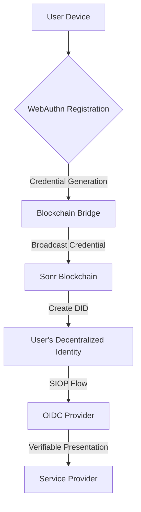

# Migrating from Centralized to Decentralized Authentication

## Overview

Sonr is transitioning from a centralized authentication model using 8787 endpoints to a fully decentralized, privacy-preserving authentication system leveraging OpenID Connect (OIDC), Self-Issued OpenID Provider (SIOP), and WebAuthn technologies.

### Key Improvements

- **Decentralization**: Move from centralized identity management to self-sovereign identity
- **WebAuthn Integration**: Hardware-backed, phishing-resistance authentication
- **Gasless Onboarding**: Zero-cost user registration and transactions
- **Automatic Vault Creation**: Seamless user experience with instant identity setup
- **Enhanced Privacy**: DID-based authentication with verifiable presentations

## Architecture Comparison

### Old Architecture: Centralized 8787 Endpoints

- Centralized authentication server
- Fixed credential storage
- Limited authentication methods
- Higher security risks

### New Architecture: Decentralized OIDC Provider



## Migration Steps

### 1. Prerequisites

- Go 1.24.1+
- Cosmos SDK v0.50.14
- WebAuthn-compatible browser/device
- Updated Sonr SDK

### 2. Configuration Changes

#### Environment Variables

<CodeGroup>
```bash title="Old Configuration"
# Centralized auth endpoints
AUTH_ENDPOINT=https://8787.sonr.io/auth
AUTH_CLIENT_ID=legacy-client-id
```

```bash title="New Configuration"
# Decentralized OIDC configuration
OIDC_PROVIDER_URL=https://oidc.sonr.network
WEBAUTHN_ORIGIN=https://your-app.com
DID_RESOLVER_URL=https://did.sonr.network
```

</CodeGroup>

### 3. Endpoint Migration

| Old Endpoint     | New Endpoint         | Changes                 |
| ---------------- | -------------------- | ----------------------- |
| `/auth/login`    | `/oidc/authorize`    | OIDC authorization flow |
| `/auth/register` | `/webauthn/register` | WebAuthn registration   |
| `/auth/token`    | `/oidc/token`        | Token issuance via SIOP |

### 4. API Changes

#### Request Format

<CodeGroup>
```json title="Legacy Request"
{
  "username": "user@example.com",
  "password": "legacy-password"
}
```

```json title="New WebAuthn Request"
{
  "challenge": "base64-encoded-challenge",
  "attestation": {
    "type": "public-key",
    "id": "credential-id",
    "rawId": "base64-encoded-raw-credential",
    "response": {
      "clientDataJSON": "...",
      "attestationObject": "..."
    }
  }
}
```

</CodeGroup>

### 5. WebAuthn Integration

#### Registration Flow

1. Generate registration challenge
2. Create WebAuthn credential
3. Broadcast credential to blockchain
4. Automatically create user vault
5. Issue decentralized identifier (DID)

#### Code Example

```go title="WebAuthn Registration Handler"
func (s *Server) HandleWebAuthnRegistration(w http.ResponseWriter, r *http.Request) {
    // 1. Validate WebAuthn attestation
    credential, err := s.webAuthnService.VerifyRegistration(attestationData)

    // 2. Broadcast to blockchain
    didDoc, err := s.blockchainBridge.CreateDID(credential)

    // 3. Create user vault
    vault, err := s.vaultService.CreateVault(didDoc)

    // 4. Issue OIDC token
    token := s.oidcService.IssueToken(didDoc)
}
```

### 6. SIOP (Self-Issued OpenID Provider)

#### Key Concepts

- Verifiable Presentations
- Decentralized Identifiers (DIDs)
- User-controlled authentication

### 7. Error Handling

#### Migration Errors

| Error Code               | Description            | Mitigation           |
| ------------------------ | ---------------------- | -------------------- |
| `AUTH_LEGACY_DEPRECATED` | Legacy auth method     | Upgrade client       |
| `WEBAUTHN_UNSUPPORTED`   | Device incompatibility | Use alternative auth |
| `DID_RESOLUTION_FAILED`  | Identity verification  | Retry registration   |

### 8. Testing Migration

```bash
# Validate WebAuthn registration
sonr webauthn test-registration

# Verify OIDC provider
sonr oidc validate-provider

# Check DID resolution
sonr did resolve did:sonr:example
```

### 9. Breaking Changes

- Legacy password authentication removed
- Token format changed to JWT with DID claims
- New client libraries required
- WebAuthn mandatory for registration

## Rollback Procedure

If issues arise:

1. Maintain legacy user mappings
2. Provide fallback authentication
3. Gradual, opt-in migration

## Conclusion

This migration represents a significant leap in authentication security and user privacy. By adopting WebAuthn, SIOP, and blockchain-backed identities, we're creating a more robust, user-controlled authentication ecosystem.

## Support

- [Sonr Developer Docs](/docs)
- [WebAuthn Specification](https://www.w3.org/TR/webauthn-2/)
- [OIDC Community](https://openid.net/developers/specs/)
